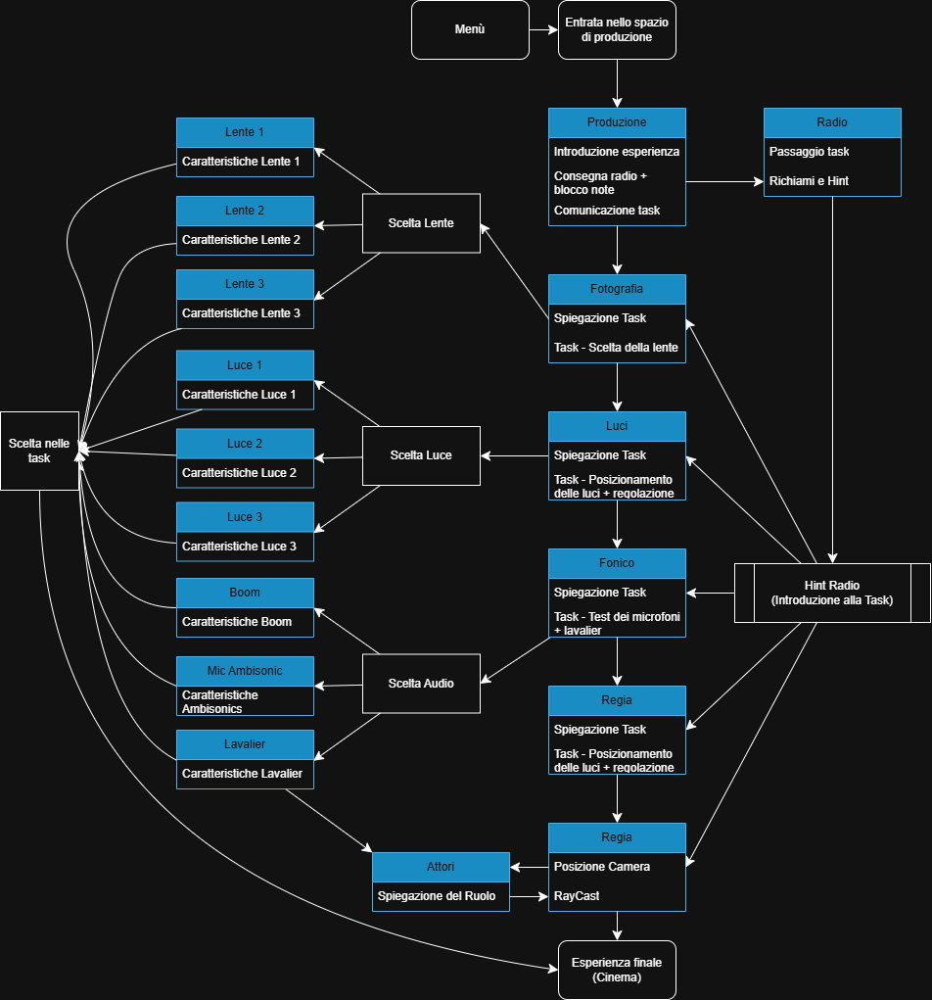

# Il mio primo giorno 🎬

> **Un'esperienza interattiva per scoprire il dietro le quinte del cinema.**

## 📖 Contesto
Nel mondo del cinema, la collaborazione tra i diversi reparti è essenziale per la riuscita di un film. Tuttavia, spesso chi si avvicina a questo settore non conosce davvero i ruoli e le responsabilità di ciascuna figura professionale.

**"Il mio primo giorno"** nasce per offrire un’esperienza interattiva e formativa che simula il ruolo di **stagista sul set** durante le riprese, permettendo all’utente di esplorare e comprendere il lavoro che avviene dietro la cinepresa.

## 🎯 Scopo del Progetto
L’applicazione mira a far scoprire in modo educativo e ludico i compiti delle principali figure professionali del cinema:
* 🎬 **Produzione**
* 🎙️ **Fonico**
* 💡 **Direttore della Fotografia (Luci & Lenti)**
* 🎬 **Attori**
* 🎬 **Regista**

Il giocatore interagisce con NPC (Non-Playable Characters) che assegnano compiti e decisioni pratiche. La qualità delle tue scelte (es. quale microfono usare, come posizionare le luci) influenzerà la **qualità della ripresa finale**, che verrà mostrata sul grande schermo alla fine dell'esperienza.

## 🎮 Gameplay & Comandi
L'esperienza è un'applicazione **Desktop 3D** in prima persona.

| Tasto | Azione |
| :---: | :--- |
| **W A S D** | Movimento nello spazio |
| **SPAZIO** | Salto |
| **E** | Interazione con oggetti e NPC |
| **G** | Rilascio di oggetti |

### Flusso di Gioco
Il giocatore deve completare diverse task per preparare la scena finale:

1.  **Briefing:** Introduzione nello spazio di produzione.
2.  **Scelte Tecniche:** Selezione lenti, luci e microfoni in base alle richieste.
3.  **Setup:** Posizionamento degli attori e dell'attrezzatura.
4.  **Azione:** Ripresa della scena finale.

*(Il diagramma logico dell'esperienza)*

## 👥 Target
Il progetto è pensato per:
* Studenti di cinema.
* Appassionati di audiovisivo.
* Utenti interessati a scoprire il "dietro le quinte" della produzione cinematografica in un formato interattivo.

## 🛠️ Tecnologie
* **Engine:** Unity 3D
* **Linguaggio:** C#
* **Assets:** Blender

---
*Progetto sviluppato per il corso di Realtà Virtuale al Politecnico di Torino.*
